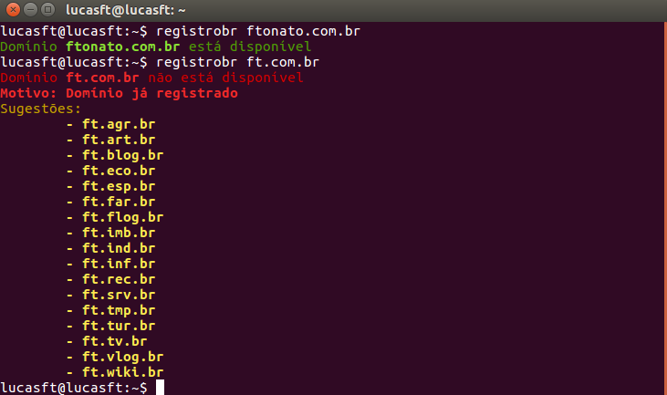

# registrobr

> Pesquise a disponibilidade de domínios desejados no Registro.br

## Instalação

```console
npm i -g registrobr
```

## Modo de usar

```sh
$ registrobr <dominio>
$ registrobr ft.com.br
```


Há uma lista de categorias de domínio .br oferecidas pelo Registro.br, [consulte aqui](http://registro.br/dominio/categoria.html) para saber mais.

## Licença

[MIT](https://github.com/ftonato/registrobr/blob/master/LICENSE.md) &copy; Ademílson F. Tonato